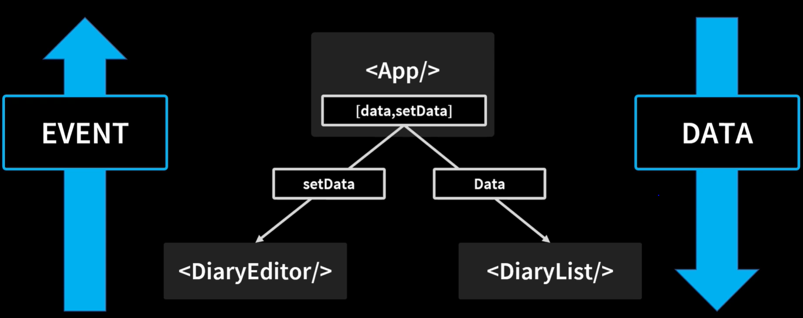

# React Diary App
| ✏ 개념 기록
## useRef로 input focusing 구현.
- useRef로 지정한 객체는 current라는 프로퍼티를 제공해 해당 요소에 접근 가능.
```jsx
const titleInput = useRef();

const onSubmitHandler = (e) =>{
    ...
    if(title.length < 1){
        titleInput.current.focus();
        return
    }
    ...
}
```
## default props
- props로 undefined가 들어와 에러가 뜨는 것을 방지하기 위해 defult설정이 가능.
```jsx
DiaryList.defaultProps ={
    diaryList:[],
}
```
## 데이터 배열 추가하기
- React는 단방향 데이터 구조.
- 그래서 상위 컴포넌트 `App.js`에 `useState`로 데이터 배열과 setter 함수를 등록한다.
  - 하위 컴포넌트 `DiaryEditor` 에서 onCreate 함수를 통해 data를 업데이트
  - useState의 data가 바뀌므로 하위 컴포넌트 `DiaryList`의 data도 함께 리렌더링 됨.



```jsx
function App() {
    const [data, setData] = useState([]);
    const dataId = useRef(0);

    const onCreate = (author, content, emotion) => {
        const created_date = new Date().getTime();
        const newItem = {
            author,
            content,
            emotion,
            created_date,
            id:dataId.current,
        };
        dataId.current += 1;
        setData([newItem, ...data]);
    }

    return (
        <div className="App">
            <h1>오늘의 일기</h1>
            <DiaryEditor onCreate={onCreate}/>
            <DiaryList data={data}/>
        </div>
    );
}

export default App;
```

## 데이터 삭제하기
- 삭제한 데이터를 제외한 배열을 `useState`를 통해 업데이트해준다.
- 상위 컴포넌트 `App.js`에 `onDelete`함수를 만들어 삭제버튼이 있는<br>
하위 컴포넌트까지 props로 보내준다.
```jsx
//App.js
const onDelete = (targetId) => {
    window.confirm(`${targetId}번 게시물을 삭제하시겠습니까?`);
    const newList = data.filter(item => item.id !== targetId);
    setData(newList);
}

//하위 컴포넌트
<button onClick={() => onDelete(list.id)}>삭제</button>
```
> **하위 컴포넌트 -> 상위 컴포넌트로 데이터 전달**<br>
> - react
>   - 하위에서 상위로 props로 값을 넘겨줄 수 없다.<br>
>   그래서 상위 컴포넌트에 함수를 만들어 prop로 넘겨주고<br>
>   하위 컴포넌트에서는 함수를 props로 받아 인자값을 넘겨줘야한다.
> - vue
>   - emit을 통해 하위에서 상위로 데이터 전달 가능

## 데이터 수정하기
- 수정 모드에 대한 상태를 지정한다.
```jsx
const [isEdit, setIsEdit] = useState(false);

const toggleEdit = () => setIsEdit(!isEdit);
```
- 수정일 때 별도의 `<textarea/>`를 만들다면 value 값에 대한 State를 추가한다.
```jsx
const [localContent, setLocalContent] = useState("");
{
    isEdit ?
            <>
                <textarea value={localContent} onChange={(e)=>setLocalContent(e.target.value)}/>
            </>
            :
            <>
              {content}
            </>
}
```

- 수정 완료에 대한 이벤트는 데이터 배열이 있는 상튀 컴포넌트에서 만들어 props로 전달한다.(업데이트시 리렌더링을 위해)
```jsx
//App.js (수정할 데이터가 존재하는 상위 컴포넌트)

const [data, setData] = useState([]);

const onEdit = (targetId, newContent) => {
    setData(
        data.map((item) => item.id === targetId ? {...item, content:newContent} : item)
    )
}

```

## map 활용
- 배열의 요소를 변경하여 새로운 배열을 리턴.
```jsx
const getData = async () => {
    const res = await axios.get('')
            .then(res => res.data);
    
    const initData = res.splice(0,20).map(item => {
        return{
            author : item.email,
            content: item.body,
            emotion : Math.floor(Math.random() * 5)+1,
            created_data : new Date().getTime(),
            id : dataId.current++
        }
    })
  setData(initData);
}

```

## Reference
- https://www.inflearn.com/course/%ED%95%9C%EC%9E%85-%EB%A6%AC%EC%95%A1%ED%8A%B8/dashboard
