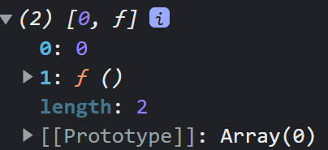

## useState
- 동적으로 상태를 관리할 때 사용하는 훅
- 특정 데이터의 상태를 컴포넌트 내에서 제어하고 싶을 때 사용
```jsx
const [state, setState] = useState();
// state 자리는 초기 상태값으로 useState() 이 안에 설정
// setState는 상태를 업데이트 할때 사용되는 함수.

console.log(useState(0));
// 콘솔로 찍어보면 아래와 같이 2개 값의 배열이 있으며 0에는 useState 내에 들어간 인수가,
// 1에는 함수가 설정되어있는것을 확인할 수 있다.
```


```jsx
// 1. react에서 useState import
import React, {useState} from 'react';

const Counter = () => {
    // 2. num의 초기값이 useStaet 내부에 들어가고
    // 3. 뒤에 있는 setNumber가 setter 함수가 됨.
    const [num, setNumber] = useState(0);
    // const num = 0;

    const Increase = () =>{
        setNumber(num + 1)
        // num = num + 1;
    }

    const decrease = () =>{
        setNumber(num - 1)
    }

    return (
        <div>
            {/* 3. 함수를 사용할 때는 중괄호 안에*/}
            <button onClick={Increase}>+1</button>
            <button onClick={decrease}>-1</button>
            {/* 
            4. setNumber setter 함수에 따라 동적으로 바뀌는
            num 의 상태를 확인할 수 있음.
            */}
            <p>{num}</p>
        </div>
    )
}
export default Counter;
```

- input example
* Vue 와 차이
- vue에서는 v-model로 value값 바인딩이 가능.
- react에서는 usestate 초기값을 설정하고 변경되는 값을 설정을 해줘야함.
```jsx
import React, {useState} from 'react';

const Input = () => {
    const [txtValue, setTextValue] = useState("");

    const onChange = (e) => {
        setTextValue(e.target.value);
    }

    return (
        <div>
            <input type="text" value={txtValue} onChange={onChange}/>
            <br/>
            <p>{txtValue}</p>
        </div>
    )
}
export default Input;

```

- 다중 state 관리 useState example
- 동적으로 프로퍼티 이름 들고올 때 대괄호 사용[]

```jsx
import React, {useState} from 'react';

const Input2 = () => {
    // input 초기값 세팅
    const [inputs, setInputs] = useState({
        name:"",
        email:"",
        tel:""
    });
    const {name, email, tel} = inputs;

    const onChange = (e) => {
        const value = e.target.value;
        const id = e.target.id;
        setInputs({
            // 깊은 복사
            ...inputs,
            // name:"",
            // email:"",
            // tel:""
            // 각각의 input이 바뀔 때마다 해당 id의 값을 들고와
            // value를 업데이트 시킨다.
            [id]:value
        })
    }

    return (
        <div>
            <div>
                <label>이름</label>
                <input type="text" id="name" value={name} onChange={onChange}/>
            </div>
            <div>
                <label>이메일</label>
                <input type="email" id="email" value={email} onChange={onChange}/>
            </div>
            <div>
                <label>전화번호</label>
                <input type="tel" id="tel" value={tel} onChange={onChange}/>
            </div>
            <p>이름 : {name}</p>
            <p>이메일 : {email}</p>
            <p>전화번호 : {tel}</p>
        </div>
    )
}
export default Input2;
```